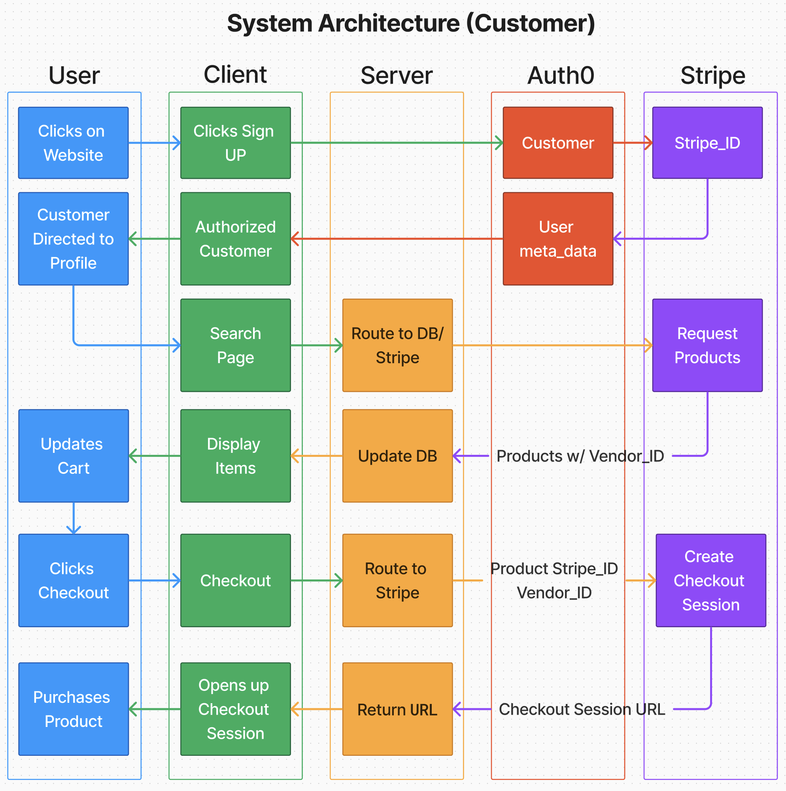
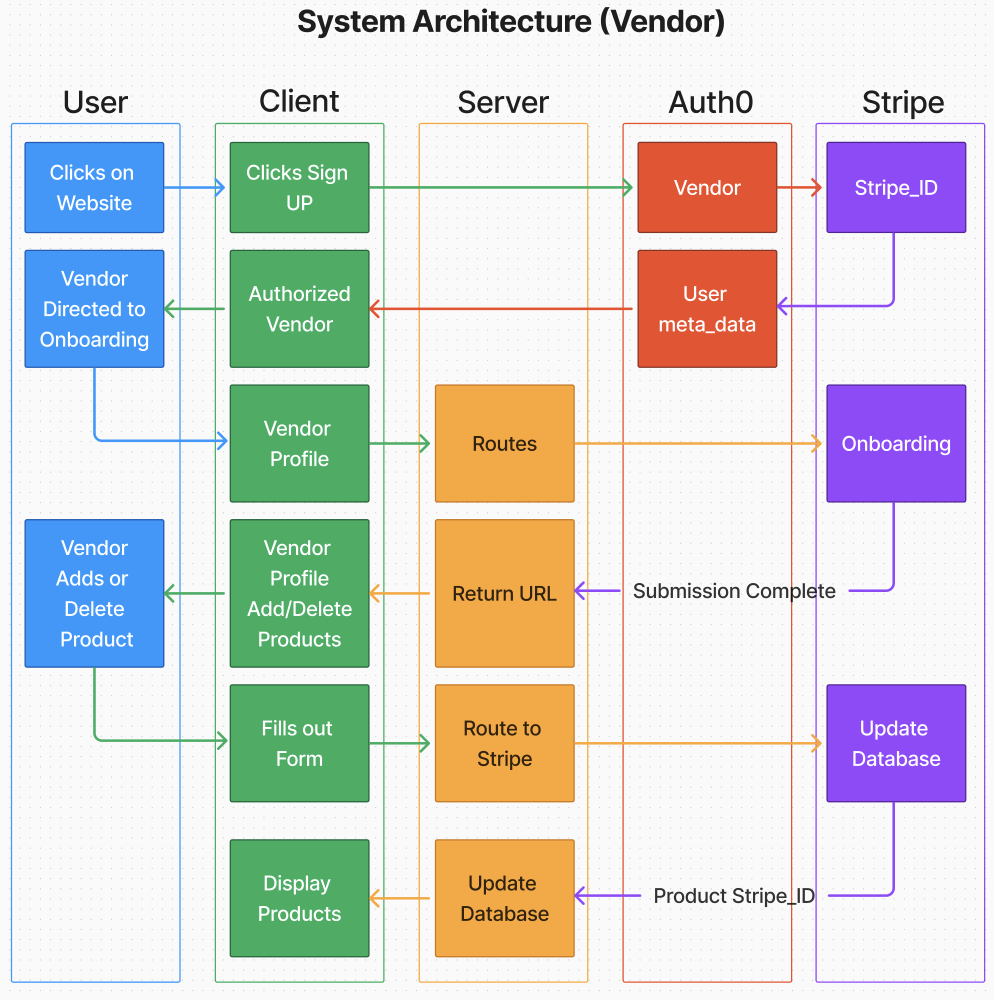

# City Greens - Frontend


City Greens is a web application that allows users to find community Produce Sellers
in their area and allows City Growers to list their produce. The user can navigate
the City Greens website and buy or sell products depending on their role. The user
can check out once they have found products they like as a buyer. The user can adjust
prices and update or remove quantities as a seller.

## Project Overview

Here are the key features of City Greens:

- **Customers:**
  - Can create an account
  - Can search for produce sellers in their area
  - Can view a list of produce sellers in their area

- **Vendors:**
  - Can create an account
  - Can list their produce
  - Can update/delete their produce listings

## Architecture





## Installation

1. Clone the repository

    ```sh
    git clone https://github.com/your-username/city-greens-frontend.git
    ```

2. Navigate to the project directory

    ```sh
    cd city-greens-frontend
    ```

3. Install the dependencies

    ```sh
    npm install
    ```

4. Create a `.env` file in the root directory and add your environment variables
as needed

## Usage

1. Start the development server

    ```sh
    npm run dev
    ```

2. Build for production

    ```sh
    npm run build
    ```

3. Preview the production build

    ```sh
    npm run preview
    ```

4. Lint the project

    ```sh
    npm run lint
    ```

## Tree

```sh
├── .gitignore
├── LICENSE
├── README.md
├── index.html
├── package-lock.json
├── package.json
├── postcss.config.js
├── public
│   ├── _redirects
│   └── vite.svg
├── src
│   ├── App.css
│   ├── App.jsx
│   ├── Components
│   │   ├── 404.jsx
│   │   ├── Cart.jsx
│   │   ├── Footer.jsx
│   │   ├── Header.jsx
│   │   ├── Hero.jsx
│   │   ├── Home.jsx
│   │   ├── Loading.jsx
│   │   ├── NearbyVendors.jsx
│   │   ├── Profile
│   │   │   ├── Customer
│   │   │   │   └── index.jsx
│   │   │   └── Vendor
│   │   │       ├── Product.jsx
│   │   │       ├── ProductForm.jsx
│   │   │       ├── ProductList.jsx
│   │   │       ├── VendorDisplay.jsx
│   │   │       ├── VendorOnBoarding.jsx
│   │   │       ├── Verification.jsx
│   │   │       └── index.jsx
│   │   ├── Search
│   │   │   ├── BigSearch.jsx
│   │   │   ├── Product.jsx
│   │   │   ├── ProductList.jsx
│   │   │   └── index.jsx
│   │   ├── SignIn.jsx
│   │   ├── SignUp.jsx
│   │   └── VendorInfoCard.jsx
│   ├── assets
│   │   ├── city-greens-logo.png
│   │   ├── gen-produce.jpg
│   │   ├── hero.jpg
│   │   └── hero2.jpg
│   ├── hooks
│   │   ├── customAuth.js
│   │   └── customStripe.js
│   ├── index.css
│   ├── main.jsx
│   └── storage
│       ├── cart.js
│       ├── index.js
│       └── products.js
├── tailwind.config.js
├── temp
│   ├── home.jsx
│   ├── refresh.jsx
│   └── return.jsx
└── vite.config.js
```

## Dependencies

```json
{
  "@auth0/auth0-react": "^2.2.4",
  "@reduxjs/toolkit": "^2.2.5",
  "fuse.js": "^7.0.0",
  "react": "^18.2.0",
  "react-dom": "^18.2.0",
  "react-icons": "^5.2.1",
  "react-redux": "^9.1.2",
  "react-router-dom": "^6.23.1",
  "redux": "^5.0.1"
}
```
